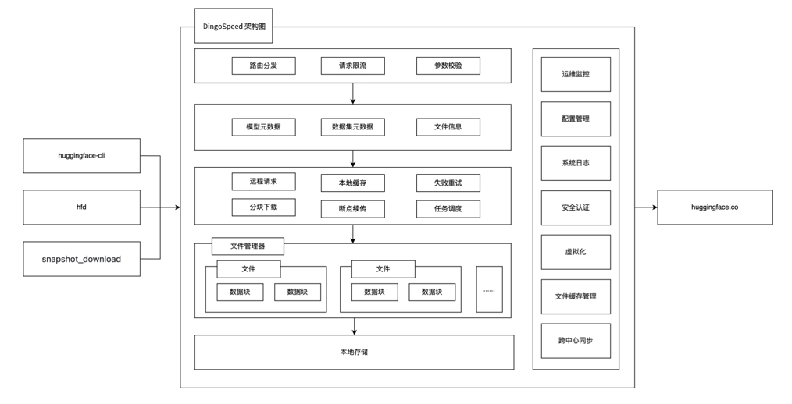
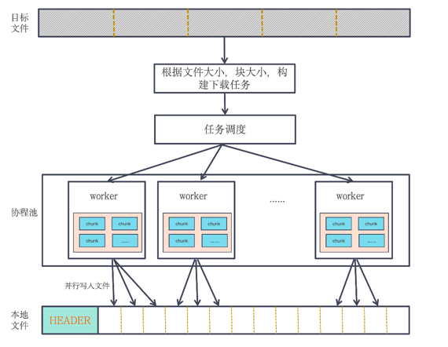

# dingo-hfmirror
[English](README.md) | 简体中文

dingo-hfmirror 是一个自托管的 Hugging Face 镜像服务，旨在为用户提供便捷、高效的模型资源访问和管理解决方案。通过本地镜像，用户可以减少对远程 Hugging Face 服务器的依赖，提高资源获取速度，同时实现数据的本地化存储和管理。

# 产品特性
dingo-hfmirror具备以下主要产品特性：
* 镜像加速：将首次下载的资源做缓存，客户端下次请求时将从缓存读取并返回，极大提升下载速率；
* 便捷访问：无需科学上网及复杂的网络配置，只需部署dingo-hfmirror服务，并将其作为代理地址，即能方便的完成下载；
* 缩流减载：一次下载多次使用，减少重复下载带来的流量浪费，高效且省流；
* 本地化管理：实现镜像服务本地编译、部署、监控及使用的全流程覆盖，带来灵活可控的卓越体验，避免了对外部网络和公共镜像仓库的依赖，显著提升了系统的响应速度和数据安全性。

# 功能清单
1. [x] 实现了 HTTP RESTful API（兼容 HF Hub 规范），支持模型和数据集下载；
2. [x] 实现了多种缓存清理策略（LRU/FIFO/LARGE_FIRST）、定时任务、阈值触发；
3. [x] 支持 HTTP Range 请求，实现客户端断点续传，服务端分块下载大文件，降低内存占用；
4. [x] 支持跨多个镜像节点同步缓存数据，避免多节点重复下载同一文件；
5. [x] 支持大文件分块存储、多副本存储节点；
6. [x] 下载耗时较低，并发下载成功率较高；
7. [x] 内存占用率较低；
8. [x] 下载速度稳定；

# 系统架构


# 安装
项目会使用wire命令生成所需的依赖代码，安装wire命令如下：
```bash
# 导入到项目中
go get -u github.com/google/wire

# 安装命令
go install github.com/google/wire/cmd/wire
```

Wire 是一个灵活的依赖注入工具，通过自动生成代码的方式在编译期完成依赖注入。 在各个组件之间的依赖关系中，通常显式初始化，而不是全局变量传递。 所以通过 Wire 进行初始化代码，可以很好地解决组件之间的耦合，以及提高代码维护性。

> 本项目使用go mod管理依赖，需要go1.23以上版本。使用makefile管理项目，需要make命令

```bash
# 1. 安装依赖
make init

# 2. 代码生成
make wire

# 3. 编译可执行文件，当前系统版本
make build

# 4. mac上编译linux可执行文件
make macbuild

# 5. 为每个文件添加licence
make license

```
# 快速开始
将编译生成的二进制部署文件，执行./dingo-hfmirror启动。然后将环境变量`HF_ENDPOINT`设置为镜像站点(这里是http://localhost:8090/)。

Linux:
```shell
export HF_ENDPOINT=http://localhost:8090
```
Windows Powershell:
```shell
$env:HF_ENDPOINT = "http://localhost:8090"
```
从现在开始，HuggingFace库中的所有下载操作都将通过此镜像站点代理进行。可以安装python库试用：
```shell
pip install -U huggingface_hub
```
```shell
from huggingface_hub import snapshot_download

snapshot_download(repo_id='Qwen/Qwen-7B', repo_type='model',
local_dir='./model_dir', resume_download=True,
max_workers=8)

```
或者你也可以使用huggingface cli直接下载模型和数据集.
下载GPT2:
```shell
huggingface-cli download --resume-download openai-community/gpt2 --local-dir gpt2
```
下载单个文件：
```shell
huggingface-cli download --resume-download --force-download  HuggingFaceTB/SmolVLM-256M-Instruct config.json
```
下载WikiText:
```shell
huggingface-cli download --repo-type dataset --resume-download Salesforce/wikitext --local-dir wikitext
```
您可以查看路径./repos，其中存储了所有数据集和模型的缓存。

# 下载模型

通过将文件按一定的大小切分成数量不等的文件段，由调度工具将任务提交到协程池执行下载任务，每个协程任务将所分配的长度提交到远端请求，按照一个chunk大小来循环读取响应
结果，并将结果缓存的协程独有的工作队列，由推送协程将其推送的客户端。同时每次检查当前chunk是否满足一个block的大小，若满足则将该block写入文件。



# 存储模型

仓库缓存数据文件由HEADER和数据块量两部分构成，其中HEADER作用：
1.提高缓存文件的可读性，当配置文件被修改或程序升级，都不会影响已缓存文件的读取；
2.能高效的检查块是否存在，无需读取真实的数据库，提高操作效率。


